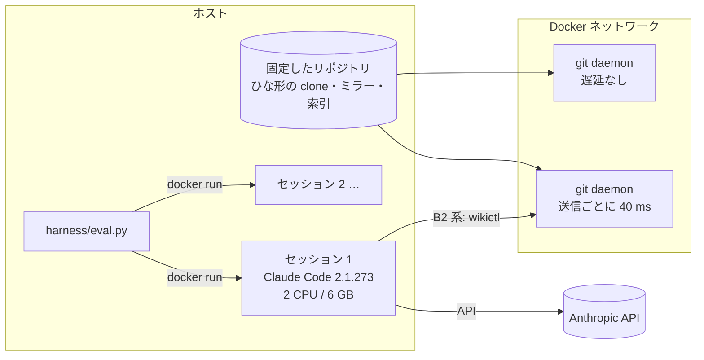

# リモートの Markdown リポジトリを読む道具は、clone と標準のコマンドに並べるか

wikictl を題材にした、コーディングエージェントの品質・費用・時間（QCD）の評価

2026-09-18、roamer7038/wikictl-eval

## 概要

Git リポジトリの Markdown 文書を、clone せずにリモートから読み書きする CLI、wikictl を題材にして、コーディングエージェント（Claude Code）の作業の品質・費用・時間を測った。題材は kubernetes/website、kubernetes/enhancements、mdn/content の固定したコミットで、課題は、値の参照、全文検索、集計、履歴、曖昧な表現からの特定、多段の参照、2 つのリポジトリの照合、セッションをまたぐ作業、同時の書き込みの 11 個である。条件は、文書を使わない（B0）、clone と標準のコマンド（B1）、wikictl v0.4.1 とそのスキル（B2）、wikictl の試作とスキルの変形（B2-best、B2-lean）の 5 つ。Claude Opus 5、Sonnet 5、Haiku 4.5 で各 3 回、計 423 グループを Docker の中で実行した。

主な結果は次の 3 つである。(1) 文書を読めない B0 の点は 0.23〜0.31 で、B1・B2 系（0.84〜1.00）との差は大きい。(2) B2 は品質が B1 と同じ水準だったが、費用が 1.2〜1.8 倍、時間が 1.7〜2.3 倍かかった。原因は、ファイルを 1 つずつ読む呼び出しの繰り返し（主に Haiku）、呼び出しのたびの fetch、履歴を読む手段の欠如、スキルを読み込む固定の費用である。まとめて読むコマンド、履歴のコマンド、fetch の省略、ヘルプへの手順の記載、短いスキルを組み合わせると、Opus では B1 と同等（費用 1.07 倍、時間 1.04 倍）になったが、B1 を上回りはしなかった。(3) 入力トークンは Sonnet が Opus の 1.88 倍、Haiku が 2.27 倍で、1 回の費用の比は単価の比より大きい。成功 1 回あたりの期待費用では、Haiku が最も安い（0.28 USD、Sonnet 0.35 USD、Opus 0.64 USD）が、Haiku の成功率が落ちる課題では上位のモデルのほうが安くなった（11 課題中、Opus < Haiku が 2、Sonnet < Haiku が 5）。Opus が Sonnet より安くなった課題はなかった。数値は、別のエージェントが生データから独立に計算し直して照合した。

## 1. はじめに

コーディングエージェントに、チームの wiki や設計文書などの Markdown の知識を使わせる方法は、大きく 2 つある。1 つは、リポジトリを手元に clone し、エージェントが使い慣れた `grep`・`cat`・`git` で読む方法。もう 1 つは、リモートのリポジトリを専用の道具で読み書きする方法で、wikictl はこちらに当たる。wikictl は git だけで動き、デーモンもワーキングツリーも持たず、読み取りの前に fetch して常に最新を読み、書き込みを 1 コミットとして push する。

専用の道具には、エージェントがそれを知らない、使い方の説明を読む必要がある、といった費用がある。一方、手元のファイルを持たないことは、同期や同時の書き込みの扱いで利点になりうる。本報告は、読み取りを中心に、次の問いに答える。

- RQ1: 情報がローカルにある場合（B1、B2）と、ない場合（B0、モデルの知識だけ）で、結果はどれだけ違うか。
- RQ2: B2 は B1 と比べて、品質・費用・時間でどう違うか。差があるなら、何がそれを縮めるか。
- RQ3: モデルの能力によって、使うトークンと費用はどう変わるか。上位のモデルのほうが結果的に安くなるのはどんなときか。

## 2. 方法

### 2.1 題材

| リポジトリ | コミット（2026-09-16） | 使う情報 |
|---|---|---|
| kubernetes/website | `aa4e9e6` | feature gate のページ（英語 487、中国語訳 466）の frontmatter `stages`、文書の本文とリンク、履歴 |
| kubernetes/enhancements | `766deac` | KEP の `kep.yaml`（owning-sig、stage、milestone、feature-gates） |
| mdn/content | `8e307de` | ページ 14,661 の frontmatter（`status`、`page-type`、`slug`）、本文の参照、履歴 |

正解は、固定したコミットの frontmatter と履歴からプログラムで計算した（`gen/tasks.py`）。値の多くは 2026 年に変わったもので、モデルの知識が古いことを測れるようにした。

### 2.2 課題

| ID | 型 | 内容 | 採点 |
|---|---|---|---|
| L1 | 値 | feature gate 14 問（翻訳が古い gate の v1.37 での段階、段階に入った版、存在しない gate） | 正答・古い値・不明・誤り |
| L2 | 値 | MDN のページ 14 件の `status`（2026 年に外れた・加わった・変わらない、存在しないページ） | 同上 |
| P2 | 全文検索 | あるフラグに触れているただ 1 つのページ（8 問） | 正答 |
| P3K | 集計 | 条件に当てはまる feature gate（19・18・18 件） | F1 |
| P3M | 集計 | 条件に当てはまる MDN のページ（60・9・58 件） | F1 |
| P4 | 履歴 | 段階や status が変わったコミットの日付（8 問） | 正答 |
| P5 | 曖昧な表現 | 名前を示さない日本語の説明（5）と英語の言い換え（5）から gate を特定 | 正答 |
| P6 | 多段の参照 | リンク先のページの title、KEP の SIG が持つ他の KEP、参照先の API の status（9 問） | 正答・F1 |
| P7 | 照合 | KEP と文書で段階の版が食い違う gate（2 問） | F1 |
| P8 | セッションをまたぐ | 1 回目の課題文でだけ伝えたチームの判断を、2 回目（会話も作業ディレクトリも引き継がない）で文書と合わせて使う | 2 回目の F1 |
| P9 | 同時の書き込み | 3 エージェントが同時に 5 件ずつ調べ、ページを作り、同じ一覧に行を加える | 欠け・誤り・重複・消失・並び順 |

P5 の問題文は Opus で作り、別の呼び出しが候補 10 件から正しい gate を選べたものだけを使った。課題文は日本語で、条件の間で同じにし、違うのは「環境」の節（情報源の場所と使えるコマンド）だけとした。

成功は、全問正答（F1 ≥ 0.95 を正答）で、かつ課題文の規則に反しなかったこととした。規則違反は、B2 系で wikictl のミラーを git で読むこと、git でリモートに直接アクセスすることである（システムでは止めていない）。

実行後の検証で、2 つの問いが 2 通りに読めることが分かった。P3K の「v1.37 で beta の段階に入った」は、その版から始まる段をすべて数えるか、前から同じ段階で既定値が変わっただけのものを除くか。P7 の 2 問目の「website の feature gate のページに stable の段階がないもの」は、ページが存在しない gate を含むか。Opus は P3K の 12 回中 11 回で後者の読み方をとり、Sonnet の P7 の失敗 4 回はページのない 2 つの gate を含めたことだけによる。本報告の表は、どちらの読み方も正答とする採点による（厳密な採点は results/main-tables.md）。

### 2.3 条件

| 条件 | 文書への経路 |
|---|---|
| B0 | 使わない（P8 だけは clone を読み、チームの wiki がない） |
| B1 | clone ＋ `rg`・`cat`・`git`、Claude Code 組み込みの Read・Grep |
| B2 | wikictl v0.4.1 ＋ wikictl-claude-plugin b5763e8（スキル 105 行） |
| B2-best | 試作の wikictl（`meta`・`log`・`show`・`snapshot`、ヘルプに多数のファイルの読み方、fetch を 300 秒省く）＋ 検索の拡張 `wikictl-search` ＋ 説明文を広げ使い分けを書いたスキル（130 行） |
| B2-lean | B2-best と同じ wikictl と拡張 ＋ コマンドの表だけのスキル（22 行） |

試作のコマンドの内容:

| コマンド | 内容 | 対応する問題 |
|---|---|---|
| `meta [--keys k,…] [<path>…]` | 各ページの frontmatter を 1 回の読み取りで JSON で出す | 多数のページを 1 つずつ `cat` する |
| `log [-n] [--since] [-p] [<path>…]`、`show <commit> <path>…` | 履歴と過去の版 | 履歴を読む手段がない |
| `snapshot <dir> [<path>…]` | 現在のファイルをローカルに書き出す（`.git` なし） | 組み込みの Read・Grep や `rg` を使えない |
| `WIKICTL_FETCH_TTL` | 最後の fetch から一定時間、読み取りの前の fetch を省く | 呼び出しごとの fetch |
| ヘルプの節「Reading many files」 | 多数のファイルを 1 回で読む手順 | スキルを読まないモデルに手順が届かない |
| `wikictl-search` | 多言語の埋め込み（paraphrase-multilingual-MiniLM-L12-v2）と BM25 による順位付きの検索 | 曖昧な表現 |

B2-best と B2-lean は、本番の前の探索的な試行（3.3 節）で、要素を 1 つずつ加えた変形（B2-trigger、B2-help、B2-nofetch、B2-skill、B2-proto）を比べて組み立てた。

### 2.4 実行環境

- 1 セッションを 1 コンテナで動かし、HOME・作業ディレクトリ・clone だけを見せた。利用者の設定、メモリ、他のプラグインは読み込ませない。ツールは Bash・Read・Write・Edit・Glob・Grep（B2 系は Skill も）。
- リモートは git daemon のコンテナで、送るパケットごとに 40 ms の遅延をかけた。
- B1 の clone と B2 系のミラー・検索の索引は、一度作ったものを各セッションに写した。どの条件も、数百 MB の取得からは始まらない。
- 本番は 2026-09-17 03:02〜14:31 UTC に、3 並列で実行した（利用制限による中断 2 回を含む）。

### 2.5 指標

- 品質（Q）: 点（問いごとの 1/0 または F1 の平均）と成功。
- 費用（C）: `result` イベントのモデルごとのトークン数に公開の単価を掛けた USD（実際はサブスクリプションの利用枠で実行）。
- 時間（D）: セッションの実時間（P9 は 3 エージェントの最大）。
- 補助: トランスクリプトのツール呼び出し、ラッパーが記録した wikictl・git・rg の実行（回数、時間、出力の大きさ）、スキルの読み込み、試作のコマンドの使用、規則違反。

## 3. 結果

### 3.1 RQ1: 情報がローカルにあるか

| モデル | B0 の点（3 課題） | B1 の点（11 課題） | B2 系の点（11 課題） |
|---|---|---|---|
| Opus | 0.26 | 1.00 | 0.99〜1.00 |
| Sonnet | 0.23 | 1.00 | 0.99〜1.00 |
| Haiku | 0.31 | 0.86 | 0.84〜0.90 |

B0 は、2026 年に変わった値を古い値で答え（L1・L2 の「古い値」）、B0 で成功したのは、Haiku の L1 と L2 の 1 回ずつだけだった。対象の文書を読めることの効果は、条件の間の違いの中で最も大きい。

### 3.2 RQ2: B2 と B1

3 回それぞれで 11 課題を合計した値の平均（最小–最大）:

| モデル | 条件 | 成功 | USD | 分 | 成功 1 回あたり USD |
|---|---|---|---|---|---|
| Opus | B1 | 11.0 | 5.16 (5.06–5.35) | 15.3 | 0.47 |
| Opus | B2 | 10.0 | 9.27 (8.53–9.64) | 27.5 | 0.93 |
| Opus | B2-best | 11.0 | 7.45 (7.13–7.94) | 17.4 | 0.68 |
| Opus | B2-lean | 11.0 | 5.51 (5.06–5.86) | 15.9 | 0.50 |
| Sonnet | B1 | 11.0 | 2.89 (2.78–3.03) | 14.7 | 0.26 |
| Sonnet | B2 | 10.0 | 4.52 (4.17–4.72) | 25.4 | 0.45 |
| Sonnet | B2-best | 11.0 | 4.11 (3.89–4.39) | 18.3 | 0.37 |
| Sonnet | B2-lean | 10.7 | 3.47 (3.33–3.69) | 18.3 | 0.33 |
| Haiku | B1 | 8.0 | 1.89 (1.80–2.01) | 17.7 | 0.24 |
| Haiku | B2 | 7.3 | 2.25 (1.92–2.59) | 40.8 | 0.31 |
| Haiku | B2-best | 8.7 | 2.14 (1.94–2.37) | 21.2 | 0.25 |
| Haiku | B2-lean | 6.3 | 2.20 (2.06–2.28) | 24.3 | 0.35 |

成功 1 回あたり USD は、3 回の USD の合計 ÷ 3 回の成功の合計。

B2 の費用と時間の内訳を、wikictl の実行の記録で見ると、次のことが分かる。

- wikictl のプロセスにかかった時間は、B2 の実時間（P9 を除く）の Opus で約 24%、Sonnet で約 20%、Haiku で約 66%。B1 との時間の差に対しては、Opus で約 5 割、Sonnet で約 4 割で、残りはモデルの推論やほかのツールの時間。
- 多数のファイルを 1 つずつ読むのは Haiku で顕著だった。集計の課題で、1 グループあたり P3K 496〜2,853 回、P3M 128〜1,485 回の `cat` を実行した（Opus 4〜7 回、Sonnet 1〜129 回）。`cat` は複数のパスを受け付けるが、Haiku はほとんど使わなかった。
- 読み取りのたびに fetch した。`cat` 1 回の中央値は v0.4.1 で 364 ms、fetch を省いた試作で 66 ms（本番の全実行）。
- 履歴を読む手段がなかった。P4 で、B2 の費用は B1 の 1.8〜5.5 倍、時間は 1.7〜6.1 倍で、ミラーを git で読む（Haiku 3/3、Sonnet 1/3）、`git ls-remote` でリモートに直接アクセスする（Opus 3/3）という規則違反が起きた。
- スキルを読み込む固定の費用がかかった。単純な参照の課題（P2）で、Opus の入力トークンは B1 の約 2 倍（キャッシュの書き込み 3.7k → 9.3k トークン、探索的試行）。

### 3.3 差を縮めた要因

本番の前に、要素を 1 つずつ加えた変形を 1 回ずつ試した（探索的試行、条件によって課題の数が 5〜11 と違う）。成功 1 回あたりの USD:

| モデル | B2 | trigger（説明文を広げる） | help（ヘルプに手順） | nofetch | skill（手順を書いたスキル） | proto（試作のコマンド） | best |
|---|---|---|---|---|---|---|---|
| Opus | 1.06 | 1.07 | 1.15 | 0.79* | 1.00 | 0.82 | 0.65 |
| Sonnet | 0.49 | 0.62 | 0.55 | 0.46* | 0.54 | 0.39 | 0.39 |
| Haiku | 0.25 | 0.38 | 0.39 | 0.25* | 0.35 | 0.23 | 0.22 |

\* nofetch は 5 課題だけで、課題の範囲の違いが値に効いている。同じ 5 課題で比べると、Opus の費用は 3.13 → 3.16 USD と変わらず、wikictl の実行時間が 136 → 32 秒に減った。

本番（3 回）で見た、課題ごとの B1 との費用の比:

| 課題 | Opus: B2 / best / lean | Sonnet: B2 / best / lean | Haiku: B2 / best / lean |
|---|---|---|---|
| P3K 集計 | 1.36 / 1.03 / 0.94 | 1.65 / 0.98 / 1.47 | 1.89 / 1.75 / 1.21 |
| P3M 集計 | 2.07 / 1.43 / 1.17 | 1.49 / 1.16 / 1.28 | 1.68 / 1.58 / 1.32 |
| P4 履歴 | 5.46 / 1.50 / 1.25 | 3.68 / 1.61 / 1.31 | 1.83 / 1.55 / 1.93 |
| P2 全文検索 | 2.00 / 1.71 / 1.15 | 1.99 / 2.76 / 1.57 | 1.29 / 1.14 / 1.14 |
| P5 曖昧な表現 | 1.79 / 1.68 / 0.93 | 1.49 / 1.71 / 1.35 | 1.02 / 1.36 / 0.87 |
| P8 セッションをまたぐ | 0.99 / 1.04 / 0.94 | 1.23 / 1.15 / 0.97 | 0.52 / 0.64 / 0.95 |
| P9 同時の書き込み | 1.50 / 1.54 / 0.97 | 1.20 / 1.34 / 1.04 | 1.28 / 1.11 / 1.44 |

時間の比は、Haiku の P3K で B2 8.54 → B2-best 1.49、Opus の P3M で B2 1.13 → B2-best 0.59、Opus の P4 で B2 6.14 → B2-best 1.22。

要素ごとに観察したこと:

- まとめて読むコマンド（`meta`）と履歴のコマンド（`log`・`show`）は、集計と履歴の課題で最も効いた。履歴のコマンドがある条件では、P4 の規則違反が Opus・Sonnet で 0 になった（Haiku の B2-lean では残った）。スキルを読まなかった Haiku の 12 グループも、`wikictl help` から `meta`・`log`・`show` を見つけて使った。
- fetch の省略は時間を減らし、費用は変えなかった。
- スキルに書いた手順は、スキルが読まれたときだけ効いた。
- ヘルプに書いた手順は、スキルを読まないモデルにも届いた。
- 短いスキル（B2-lean）は、Opus と Sonnet の費用を下げたが、Haiku の成功を減らした。

### 3.4 道具の使われ方

本番、B2 系の各 33 グループで、それを 1 回以上使ったグループの割合:

| モデル | 条件 | スキル | help | `--no-fetch` | 複数パスの `cat` | `meta` | `log` | `snapshot` | `wikictl-search` | 規則違反 |
|---|---|---|---|---|---|---|---|---|---|---|
| Opus | B2 | 1.00 | 0.79 | 0.09 | 0.39 | − | − | − | − | 0.09 |
| Opus | B2-best | 1.00 | 0.24 | 0.70 | 0.09 | 0.09 | 0.42 | 0.45 | 0.00 | 0.00 |
| Opus | B2-lean | 1.00 | 0.52 | 0.12 | 0.12 | 0.12 | 0.36 | 0.55 | 0.00 | 0.00 |
| Sonnet | B2 | 0.55 | 0.85 | 0.00 | 0.18 | − | − | − | − | 0.03 |
| Sonnet | B2-best | 0.97 | 0.18 | 0.30 | 0.24 | 0.27 | 0.21 | 0.12 | 0.00 | 0.00 |
| Sonnet | B2-lean | 0.97 | 0.64 | 0.03 | 0.09 | 0.18 | 0.21 | 0.18 | 0.00 | 0.00 |
| Haiku | B2 | 0.15 | 0.91 | 0.03 | 0.00 | − | − | − | − | 0.09 |
| Haiku | B2-best | 0.61 | 0.55 | 0.39 | 0.30 | 0.18 | 0.12 | 0.03 | 0.00 | 0.00 |
| Haiku | B2-lean | 0.42 | 0.79 | 0.21 | 0.18 | 0.21 | 0.15 | 0.06 | 0.00 | 0.15 |

（`meta`・`log`・`snapshot` は終了コード 0 の実行。`wikictl-search` の実行は 198 グループで 2 回）

- スキルを読む割合はモデルによって大きく違い、Haiku は説明文を広げても 42〜61% だった。ヘルプはどのモデルもよく読んだ。
- Opus は、`snapshot` で必要な範囲をローカルに書き出し、主に `grep` で読む方法を多く選んだ（書き出した後に `grep` を使ったのは B2-best 14/15、B2-lean 13/18、`rg` は 1/15、4/18）。1 回の書き出しは 0.1〜1.2 秒だった。
- 検索の拡張は、ほとんど使われなかった（3.6 節）。

### 3.5 RQ3: モデルの能力、トークン、費用

B1・B2・B2-best・B2-lean を合わせ、課題 × モデルごとに 12 回（厳密な採点では、Opus の成功率が 0.89、Sonnet が 0.93）。

| モデル | 成功率 | 1 回の平均 USD | 成功 1 回あたりの期待 USD | 入力トークン | ターン |
|---|---|---|---|---|---|
| Opus | 0.98 | 0.622 | 0.637 | 376k | 20.6 |
| Sonnet | 0.97 | 0.341 | 0.351 | 707k | 28.5 |
| Haiku | 0.69 | 0.193 | 0.280 | 851k | 37.2 |

成功 1 回あたりの期待費用は、1 回の平均の費用 c を成功率 p で割った値で、失敗したら試行をやり直す場合の平均の費用である。

- 入力トークンは Sonnet が Opus の 1.88 倍、Haiku が 2.27 倍、ターンも同じ順に多い。このため 1 回の費用の比（Sonnet / Opus 0.55、Haiku / Opus 0.31）は、単価の比（0.40、0.20）より大きい。
- 課題ごとの成功 1 回あたりの期待費用（Opus / Sonnet / Haiku、USD）と最安:

| 課題 | 成功率（O / S / H） | 成功 1 回あたり | 最安 |
|---|---|---|---|
| L1 | 1.00 / 1.00 / 1.00 | 0.30 / 0.14 / 0.14 | Sonnet |
| P2 | 1.00 / 1.00 / 1.00 | 0.15 / 0.06 / 0.06 | Haiku |
| P3M | 1.00 / 1.00 / 1.00 | 0.35 / 0.18 / 0.12 | Haiku |
| L2 | 1.00 / 1.00 / 0.92 | 0.27 / 0.12 / 0.14 | Sonnet |
| P5 | 1.00 / 1.00 / 0.83 | 0.24 / 0.22 / 0.16 | Haiku |
| P6 | 1.00 / 1.00 / 0.83 | 0.45 / 0.37 / 0.26 | Haiku |
| P3K | 1.00 / 1.00 / 0.75 | 0.54 / 0.26 / 0.18 | Haiku |
| P9 | 1.00 / 1.00 / 0.42 | 1.91 / 0.74 / 1.02 | Sonnet |
| P8 | 1.00 / 1.00 / 0.25 | 1.04 / 0.44 / 1.09 | Sonnet |
| P7 | 1.00 / 1.00 / 0.17 | 0.92 / 0.88 / 1.75 | Sonnet |
| P4 | 0.75 / 0.67 / 0.42 | 0.90 / 0.52 / 0.45 | Haiku |

- 上位のモデルのほうが成功 1 回あたり安かった課題は、Opus < Sonnet が 0、Opus < Haiku が 2（P7・P8）、Sonnet < Haiku が 5（L1・L2・P7・P8・P9）。Opus が最安だった課題はない。
- P9 の Haiku の失敗 7 回のうち 5 回は、一覧の並び順の誤りだけによる。並び順を問わなければ、Haiku の P9 は Sonnet より安くなる。
- 課題の難しさ（3 モデルを合わせた成功率）との順位相関は、入力トークンの比 Haiku / Opus が +0.51（易しい課題ほど Haiku の入力が多い。L1・P5 で 4.5〜4.9 倍、P7〜P9 で 1.5〜2.0 倍）、成功 1 回あたりの費用の比 Haiku / Opus が −0.53（難しい課題ほど Haiku が割高）。

### 3.6 検索の拡張

`wikictl-search` を、エージェントが実行したのは B2-best と B2-lean の 198 グループで 2 回だった。P5 は、検索を使わない B1 でも全モデルが全問正答した。エージェントは gate のディレクトリを `grep` し、候補の本文を読んで特定した。

検索だけの精度を、P5 の説明文をそのまま問いにして測った（正解の順位）:

| 方式 | 範囲 | 日本語: 1 位 / 10 位以内 | 英語の言い換え: 1 位 / 10 位以内 |
|---|---|---|---|
| vector | gate のディレクトリ | 4/5 / 5/5 | 1/5 / 4/5 |
| hybrid（既定） | gate のディレクトリ | 3/5 / 3/5 | 2/5 / 5/5 |
| bm25 | gate のディレクトリ | 2/5 / 2/5 | 2/5 / 3/5 |
| vector | `content/en/docs` 全体 | 3/5 / 4/5 | 1/5 / 2/5 |

索引の作成には、kubernetes/website で 2 CPU 約 42 分かかった。

## 4. 考察

### 4.1 wikictl の位置づけ

読み取りについて、wikictl は clone と標準のコマンドを上回らなかった。v0.4.1 では費用も時間も多くかかり、試作の機能をすべて入れて、ようやく Opus で同等になった。エージェントは、選べるときには必要な範囲をローカルに書き出して標準の道具で読んだ（Opus の `snapshot` 45〜55%）。この結果は、「エージェントがすでに持っている道具の使い方の知識を活かせる経路が、費用の点で有利」という見方を支持する。文書の中身の知識（B0）は役に立たず、有利なのは道具の使い方の知識である。

ただし、次の点で本評価は B1 に有利だった。clone の時間と容量を費用に含めていない（kubernetes/website の clone は 537 MB、遅延 40 ms で約 19 秒）。文書は固定したコミットで、作業中に変わらない。リポジトリは 3 つだけだった。wikictl の価値がありうるのは、毎回 clone が必要な環境、作業中にリモートが更新される課題、多数のリポジトリをまたぐ作業、同時の書き込みであり、これらは本評価では検証していない（P9 の同時の書き込みで更新が失われたのは、Haiku の B2-lean の 1 回（一覧の行 5 件）だけで、Haiku のほかの失敗は一覧の並び順の誤りだった。B1 と B2 の差は示せていない）。

### 4.2 エージェント向けの道具の設計

- 呼び出しの回数を減らす口を用意する。小さいモデルほど、1 件ずつ呼ぶループを書きやすい。まとめて読む口（`meta`、ローカルへの書き出し）が、最も大きく費用と時間を減らした。
- 手順は、スキルよりもコマンドのヘルプに書く。スキルはモデルによって読まれず（Haiku 15%）、読まれると本文が以後のすべての呼び出しのコンテキストに入る。ヘルプは、どのモデルも必要なときに読む。
- 迂回を防ぐには、機能を足す。履歴を読む手段がないと、エージェントは禁止されていてもミラーを git で直接読んだ。
- 1 回の呼び出しを速くしても、費用は減らない。fetch の省略は時間を減らしたが、トークンは変わらず、呼び出しを増やすモデルもあった。

### 4.3 モデルの選択

下位のモデル w が上位のモデル s より成功 1 回あたり安いのは、成功率の比 p_w / p_s が 1 回の費用の比 c_w / c_s を上回るときである。本評価の費用の比から、目安は次のとおり。

- Haiku を Opus の代わりに使ってよいのは、Haiku の成功率が Opus の約 3 割以上のとき（難しい課題、費用の比 0.22〜0.32）。易しい課題では約 4〜6 割以上。
- Haiku を Sonnet の代わりに使ってよいのは、多くの課題で Haiku の成功率が Sonnet の約 5〜7 割以上のとき。ただし Haiku は易しい参照で入力トークンが多く、費用の比が 1 を超えることがある。
- Sonnet は、成功率が Opus の約 4〜5 割を下回らない限り、Opus より安い。費用の比が 0.8〜1.0 と高い課題（P5・P6・P7）では、わずかな成功率の差で逆転しうるが、今回は Sonnet の成功率が十分高く、逆転しなかった。

逆転の主因は、トークンの増加ではなく失敗率だった。難しい課題では Opus も多くのトークンを使うので、入力トークンの比はかえって小さくなる。難しい課題は上位のモデルのほうが結果的に安くなりうるという見立ては、Haiku に対して（P7・P8・P9）支持されたが、Opus が Sonnet より安くなった課題はなく、Opus が最安の課題もなかった。ただし厳密な採点では、Sonnet の P7 の成功率が 0.67 に下がり、P7 で Opus が最安になる。難しさが事前に分からないときは、全課題で成功率 0.67 以上、成功 1 回あたりの費用が最安か 2 番目だった Sonnet が、最悪の場合の費用を抑える。

この目安は、失敗を検知してやり直せることを前提にしている。誤答に気づけない場面では、成功率の低いモデルの実際の費用はこれより大きい。

### 4.4 wikictl への提案

| 提案 | 根拠 |
|---|---|
| 多数のページの frontmatter をまとめて読むコマンド（#183） | 集計の課題で、1 件ずつの `cat` を置き換え、費用と時間を減らした |
| 履歴と過去の版を読むコマンド（#180） | ないと規則違反の迂回が起き、試作で解消した |
| 読み取りの前の fetch を一定時間省く | `cat` 1 回あたり約 0.3 秒 |
| トップのヘルプに多数のファイルの読み方を載せる | スキルを読まないモデルに届く唯一の経路 |
| 指定した範囲をローカルに書き出すコマンド | Opus の 45〜55% が選び、B1 と同じ読み方ができる |
| スキルを短くし、説明文を広げる（プラグイン） | 固定の費用が下がり、読まれる割合が上がる。小さいモデルには詳しい手順が要る |
| ベクトル検索は見送る | 使われず、課題は `grep` で解けた。索引の費用が大きい |

## 5. 妥当性への脅威

- 内的妥当性:
  - B2-best と B2-lean は、本番と同じ課題での探索的試行を見て組み立てた。未知の課題での効果は小さい可能性がある。
  - 課題文を条件の間で揃えたが、「環境」の節の説明の量は条件によって違う。
  - 規則違反はシステムで止めず、課題文で禁じて事後に数えた。違反を許容すると、Haiku の B2 と B2-lean の成功が増える（付録 C）。
  - P3K と P7 の問題文は 2 通りに読め、採点で扱いを分けた（2.2 節）。ほかの課題にも曖昧さが残っている可能性がある。P9 の一覧の並び順の採点も、Haiku の結果を大きく左右した。
  - B0 は文書の clone を渡さないことで隔離したが、イメージには wikictl と検索の拡張が入っており、B0 のセッションが実行を試みた例がある（設定がなく失敗）。
- 構成の妥当性:
  - 費用は公開の単価による換算で、サブスクリプションの利用枠の消費とは一致しない。長いコンテキストの割増しは含めていない。
  - 成功の閾値（F1 ≥ 0.95）の選び方で、成功率が変わる。
  - 時間は、API の混雑と 3 並列の実行の影響を受ける。
- 外的妥当性:
  - 題材は、frontmatter が構造化された大きな公開文書の 3 リポジトリで、モデルが学習で内容を知っている可能性がある（B0 で一部が正答した）。構造の少ない wiki や非公開の文書では結果が変わりうる。
  - エージェントは Claude Code 2.1.273 の 3 モデルだけ。
  - 遅延は 40 ms だけを本番で測った。
- 統計的な結論の妥当性: 各条件 3 回で、区間推定や検定はしていない。回ごとのばらつき（最小–最大）を併記した。

## 6. 結論

- RQ1: 文書をローカルで読めるかどうかの差は大きく、モデルの知識では代えられない（点 0.23〜0.31 対 0.84〜1.00）。
- RQ2: wikictl v0.4.1 は、読み取りで clone と標準のコマンドと同じ品質だが、費用 1.2〜1.8 倍、時間 1.7〜2.3 倍。まとめて読む口、履歴、fetch の省略、ヘルプへの手順、短いスキルで Opus は同等になったが、上回らなかった。wikictl の価値を読み取り以外（同期、書き込み、clone のない環境）に求めるなら、その条件での評価が必要である。
- RQ3: 能力の高いモデルほど少ない入力トークンで解き、Haiku は Opus の 2.27 倍を使った。成功 1 回あたりでは Haiku が最も安いが、Haiku の成功率が 1 回の費用の比を下回る課題（P7・P8・P9）では、上位のモデルのほうが安くなった。Opus と Sonnet の間では、Sonnet の成功率が十分高く、逆転は起きなかった。

## 付録

### A. 再現

手順は [README.ja.md](../README.ja.md)。集計は `grade/score.py`（採点）、`grade/qcd.py`（QCD の表、[main-qcd.md](main-qcd.md)）、`grade/models.py`（モデルの費用、[model-cost.md](model-cost.md)）。グループごとの採点は [main-scores.jsonl](main-scores.jsonl)（厳密）と [main-scores-alt.jsonl](main-scores-alt.jsonl)（P3K の 2 通りの読み方を正答）。

### B. 評価にかかった費用

公開の単価による換算:

| 区分 | セッション | USD |
|---|---|---|
| 本番 | 540 | 158.19 |
| 探索的試行（合成の題材、unshare 版、基準、変形、best、lean）と再実行 | 557 | 172.05 |
| 評価の設計・実装・分析を行ったエージェントのセッション | − | 約 115 |

### C. 規則違反を許容した場合

違反のあった 12 グループのうち 8 グループは課題に正答していた。許容すると成功（3 回の平均、11 課題中）は、Haiku の B2 が 7.3 → 8.3、B2-lean が 6.3 → 7.7、Sonnet の B2 が 10.0 → 10.3 になり、ほかは変わらない。詳細は [main.md](main.md) の付録。
